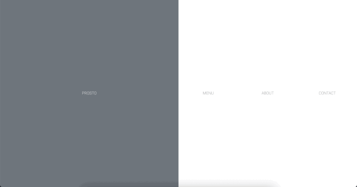

# PROSTO Restaurant

1️⃣  This is the FIRST PROJECT of the Full Stack Development Bootcamp with Geekshubs Academy. Based only on HTML and CSS.

👌  Most up-to-date version here: https://sergiotorresgarcia.github.io/Proyecto1-CartaRestaurante/

 

### 🫵 Challenge introduction

- Design and create a restaurant website to practice and show the adquired knowledge during the first week of the course 💡 

- Creation of AT LEAST 3 pages (home, contact and menu) 📃 + 📃 + 📃

- Technical stack: 💻
    - HTML5 
    - CSS3
    - CSS Layout (Flexbox & Grid)
    - elements of Bootstrap
    
    
- Special attention to design, visual cleanness and RESPONSIVENESS 🔝

- Web deployment with Github Pages 🛜
  
- Mandatory README file ⚠️
  

###  ➡️  Coding process:
- ##### Coding time: 25 - 30 hours ⏳
  
- ##### Web structure (6 pages) 💪
  -    HOME (index.html):
        -   MENU (menu.html)
        -   ABOUT (about.html)
        -   CONTACT (contact.html > register.html)
        -   GALLERY (gallery.html)

- ##### Project explanation: 💬
    -   After looking for some inspiration (gastronomy sites and others) I settled for a minimalistic design.
    -   I've decided to use a Bootstrap-based model to compose the web structure and Flexbox elements to fill in the areas.
    -   I've also adjusted Bootstrap elements for the log in and registration forms.
    -   On the HOME page, the are 3 clickable areas (big accesible buttons) that take you to the MENU, ABOUT and CONTACT pages.
        -   MENU displays a scrollable (in smaller screens) text, has a clear back(home) button while keeping in view access to all other pages.
        -   ABOUT gives some information about the business and has redirecting buttons (to log in and register pages)
        -   CONTACT displays a LOG IN form (and an extra REGISTER button for new commers)
        -   REGISTER page is only reachable through the register button (within the contact and about pages)
    -   From the HOME page and clicking anywhere, other than the 3 big buttons, it takes you to the GALLERY page where there are a few pictures and an inspirational quote (plus the back (home) button)
###  👀  Have a look: https://sergiotorresgarcia.github.io/Proyecto1-CartaRestaurante/

- ##### Stack:
    
    
    
    

